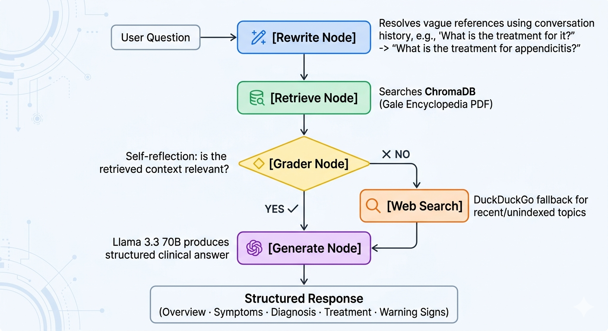

# 🩺 ClinixAI — Agentic Clinical Decision Support System

> A self-correcting medical AI agent built with LangGraph, Groq, ChromaDB, and Streamlit.
> Combines Retrieval-Augmented Generation (RAG) from a medical knowledge base with automatic web search fallback, conversation memory, and adaptive multimodal vision analysis for medical imaging.

<br>

## 🌐 Live Demo 👉 [](https://clinical-ai-agent-clinixai.streamlit.app/)


> **Note:** A free [Groq API key](https://console.groq.com) is required to use the app. Takes 2 minutes to get.

<!-- Replace the screenshot below with your actual screenshot file -->


<br>

## 🧠 How the Agent Works

The agent uses a **self-correcting LangGraph pipeline** with 4 sequential nodes:



<br>

## ✨ Features

- **Self-Correcting RAG** — Automatically falls back to web search when the knowledge base lacks relevant context
- **Query Rewriting** — Resolves vague follow-up questions using conversation history before retrieval
- **Conversation Memory** — Remembers previous turns within a session for contextual multi-turn dialogue
- **Adaptive Vision Analysis** — Detects image type (Chest X-Ray, Brain MRI, CT Scan, Bone X-Ray, Skin, Ultrasound) and applies a specialist-level prompt for each
- **Page Number Citations** — Every PDF-sourced answer shows exact page numbers from the encyclopedia
- **Structured Responses** — All answers returned in a consistent clinical format
- **Medical-Grade Embeddings** — Uses `NeuML/pubmedbert-base-embeddings` (trained on PubMed) instead of general-purpose embeddings for better medical retrieval accuracy
- **API Key per User** — Each user enters their own free Groq key — no shared quota

<br>

## 🗂️ Project Structure

```
ClinixAI/
│
├── app.py                  # Streamlit UI — main entry point
├── agent.py                # Streamlit wrapper with @st.cache_resource
├── agent_core.py           # Pure agent logic — used by FastAPI
├── api.py                  # FastAPI REST API (optional, for production use)
├── retriever.py            # ChromaDB vector store + PDF loader
├── evaluate.py             # RAGAS evaluation script
│
├── chroma_db_data/         # Auto-generated vector database (gitignored)
├── .env                    # API keys (gitignored)
├── requirements.txt        # Production dependencies
└── README.md
```

<br>

## ⚙️ Tech Stack

| Component | Technology |
|---|---|
| UI | Streamlit |
| Agent Orchestration | LangGraph |
| LLM — Reasoning | Llama 3.3 70B via Groq |
| LLM — Vision | Llama 4 Scout 17B via Groq |
| Embeddings | `NeuML/pubmedbert-base-embeddings` (HuggingFace) |
| Vector Database | ChromaDB |
| PDF Loader | PyMuPDF |
| Web Search Fallback | DuckDuckGo (`langchain-community`) |
| REST API | FastAPI + Uvicorn |
| Evaluation | RAGAS |

<br>

## 🚀 Getting Started

### 1. Clone the repository

```bash
git clone https://github.com/YOUR_USERNAME/clinical-ai-agent.git
cd clinical-ai-agent
```

### 2. Create a virtual environment

```bash
python -m venv venv

# Windows
venv\Scripts\activate

# macOS / Linux
source venv/bin/activate
```

### 3. Install dependencies

```bash
pip install -r requirements.txt
```

### 4. Set up environment variables

Create a `.env` file in the root directory:

```env
GROQ_API_KEY=your_groq_api_key_here
```

Get your free Groq API key at [console.groq.com](https://console.groq.com).

### 5. First run — knowledge base indexing

The PDF knowledge base is downloaded from Google Drive on first run and indexed into ChromaDB. This takes **3–8 minutes** and only happens once. All subsequent runs load the existing database instantly.

### 6. Run the app

```bash
streamlit run app.py
```

<br>

## 🔌 FastAPI Backend (Optional)

The agent is also exposed as a REST API via FastAPI. Run both servers in separate terminals:

**Terminal 1 — API server:**
```bash
uvicorn api:app --host 0.0.0.0 --port 8000 --reload
```

**Terminal 2 — Streamlit UI:**
```bash
streamlit run app.py
```

Once the API is running, the Streamlit sidebar shows **⬤ API Online** and all queries are routed through FastAPI.

**API documentation** is auto-generated at `http://localhost:8000/docs`

| Endpoint | Method | Description |
|---|---|---|
| `/` | GET | Health check |
| `/health` | GET | Health check |
| `/query` | POST | Text query with optional chat history |
| `/query-with-image` | POST | Vision + text query |

<br>

## 🖥️ Usage

| Action | How |
|---|---|
| Ask a clinical question | Type in the chat input and press Enter |
| Upload a medical image | Use the sidebar file uploader (JPG/PNG) |
| Combined query | Upload an image AND ask a question — both are processed together |
| Clear conversation | Click **🗑 Clear Conversation** in the sidebar |

### Source badges

Every response shows where the answer came from:

| Badge | Meaning |
|---|---|
| `📄 Knowledge Base — Pages X, Y` | Retrieved from Gale Encyclopedia of Medicine |
| `🌐 Web Search — external source` | Knowledge base lacked context, DuckDuckGo was used |

### Supported image types

The vision model automatically detects and applies specialist prompts for:

| Image Type | Specialist Prompt Applied |
|---|---|
| Chest X-Ray | Radiologist — lung fields, cardiac, mediastinum, diaphragm |
| Brain MRI | Neuroradiologist — parenchyma, ventricles, white matter |
| CT Scan | Radiologist — density, Hounsfield units |
| Bone X-Ray | Musculoskeletal radiologist — fractures, joint spaces |
| Skin | Dermatologist — ABCDE criteria |
| Ultrasound | Sonographer — echogenicity, vascularity |

<br>

## 📊 Evaluation

Evaluated on 5 clinical questions using a custom LLM-as-judge framework (Llama 3.3 70B):

| Metric | Score | Meaning |
|---|---|---|
| Answer Faithfulness | 0.85 ✅ | Answers stay grounded in retrieved context |
| Answer Relevancy | 0.80 ✅ | Answers directly address the questions asked |
| Context Precision | 0.60 ⚠ | Retrieved chunks are relevant to the query |
| **Overall Average** | **0.75** | |

> Evaluated using `NeuML/pubmedbert-base-embeddings` over the Gale Encyclopedia of Medicine (5 questions).
> Evaluation script: `evaluate.py`

<br>

## 🔑 Environment Variables

| Variable | Description | Required |
|---|---|---|
| `GROQ_API_KEY` | Your Groq API key for LLM inference | ✅ Yes |

<br>

## ⚠️ Disclaimer

This tool is intended as a **decision aid** for qualified healthcare professionals only. It does **not** replace professional clinical diagnosis, medical advice, or treatment decisions. Always consult a licensed medical professional for patient care.

<br>

## 📄 License

This project is licensed under the MIT License.

<br>

## 🙏 Acknowledgements

- [Groq](https://groq.com) — ultra-fast LLM inference
- [LangChain](https://langchain.com) & [LangGraph](https://langchain-ai.github.io/langgraph/) — agent orchestration
- [ChromaDB](https://www.trychroma.com) — vector database
- [NeuML](https://huggingface.co/NeuML) — PubMedBERT embeddings
- [Streamlit](https://streamlit.io) — UI framework
- [RAGAS](https://github.com/explodinggradients/ragas) — RAG evaluation
- [The Gale Encyclopedia of Medicine, 3rd Edition](https://staibabussalamsula.ac.id/wp-content/uploads/2024/06/The-Gale-Encyclopedia-of-Medicine-3rd-Edition-staibabussalamsula.ac_.id_.pdf) — medical knowledge base
