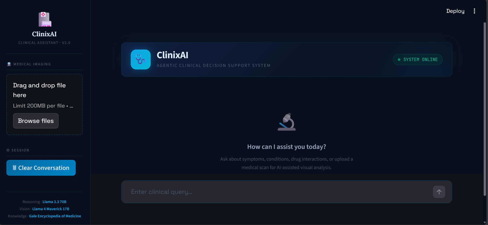

# 🩺 ClinixAI — Agentic Clinical Decision Support System

> A self-correcting medical AI agent built with LangGraph, Groq, ChromaDB, and Streamlit.  
> Combines retrieval-augmented generation (RAG) from a medical knowledge base with web search fallback and multimodal vision analysis for medical imaging.

### 🌐 Live Demo 👉 [](https://clinical-ai-agent-clinixai.streamlit.app/)

---




## ✨ Features

- **Agentic RAG Pipeline** — A LangGraph-powered graph that retrieves, grades, and generates answers autonomously
- **Self-Correction** — If the internal knowledge base doesn't have a relevant answer, the agent automatically falls back to live web search
- **Medical Vision Analysis** — Upload X-Ray, MRI, or CT scan images for AI-powered visual analysis using Llama 4 Maverick
- **Internal Knowledge Base** — Indexed from *The Gale Encyclopedia of Medicine (3rd Edition)* using ChromaDB + HuggingFace embeddings
- **Persistent Vector Store** — ChromaDB is created once and reloaded on subsequent runs — no re-indexing needed
- **Clean Dark UI** — Custom Streamlit interface with a professional clinical theme

---
## 🧠 How the Agent Works



---

## 🗂️ Project Structure

```
ClinixAI/
│
├── app.py                          # Streamlit UI — main entry point
├── agent.py                        # LangGraph agent graph definition
├── retriever.py                    # ChromaDB vector store setup & retriever
├── requirements.txt                # Python dependencies
└── README.md
```

---

## ⚙️ Tech Stack

| Component | Technology |
|---|---|
| UI | Streamlit |
| Agent Orchestration | LangGraph |
| LLM (Reasoning) | Llama 3.3 70B via Groq |
| LLM (Vision) | Llama 4 Maverick 17B via Groq |
| Embeddings | `sentence-transformers/all-MiniLM-L6-v2` (HuggingFace) |
| Vector Database | ChromaDB |
| PDF Loader | PyMuPDF |
| Web Search | DuckDuckGo (`langchain-community`) |
| Environment | Python 3.10+ |

---

## 🚀 Getting Started

### 1. Clone the repository

```bash
git clone https://github.com/your-username/ClinixAI.git
cd ClinixAI
```

### 2. Create a virtual environment

```bash
python -m venv venv

# Windows
venv\Scripts\activate

# macOS / Linux
source venv/bin/activate
```

### 3. Install dependencies

```bash
pip install -r requirements.txt
```

### 4. Set up environment variables

Create a `.env` file in the root directory:

```env
GROQ_API_KEY=your_groq_api_key_here

# Optional: configure web search provider ('duckduckgo' or 'tavily', default: duckduckgo)
SEARCH_PROVIDER=duckduckgo

# Required when SEARCH_PROVIDER=tavily; obtain from https://app.tavily.com
# TAVILY_API_KEY=tvly-your_tavily_api_key_here
```

Get your free Groq API key at [console.groq.com](https://console.groq.com).

| Variable | Required | Description |
|---|---|---|
| `GROQ_API_KEY` | Yes | Groq LLM API key |
| `SEARCH_PROVIDER` | No | `duckduckgo` (default) or `tavily` |
| `TAVILY_API_KEY` | When `SEARCH_PROVIDER=tavily` | Tavily API key from [app.tavily.com](https://app.tavily.com) |

### 5. Download the knowledge base PDF

Download **The Gale Encyclopedia of Medicine (3rd Edition)** from the following link and place it in the project root:

**PDF Source:**  
[The-Gale-Encyclopedia-of-Medicine-3rd-Edition.pdf](https://staibabussalamsula.ac.id/wp-content/uploads/2024/06/The-Gale-Encyclopedia-of-Medicine-3rd-Edition-staibabussalamsula.ac_.id_.pdf)
```

```

> The vector database (`chroma_db_data/`) will be created automatically on first run. This may take a few minutes. Subsequent runs load the existing database instantly.

### 6. Run the app

```bash
streamlit run app.py
```

---

## 🖥️ Usage

| Action | How |
|---|---|
| Ask a clinical question | Type in the chat input and press Enter |
| Upload a medical image | Use the sidebar file uploader (JPG/PNG) |
| Combined query | Upload an image AND type a question — both are sent to the agent together |
| Clear conversation | Click **🗑 Clear Conversation** in the sidebar |

### Source badges

Every response shows where the answer came from:

- `📄 Knowledge Base` — answer retrieved from the Gale Encyclopedia PDF
- `🌐 Web Search` — knowledge base didn't have enough context, DuckDuckGo was used

---
